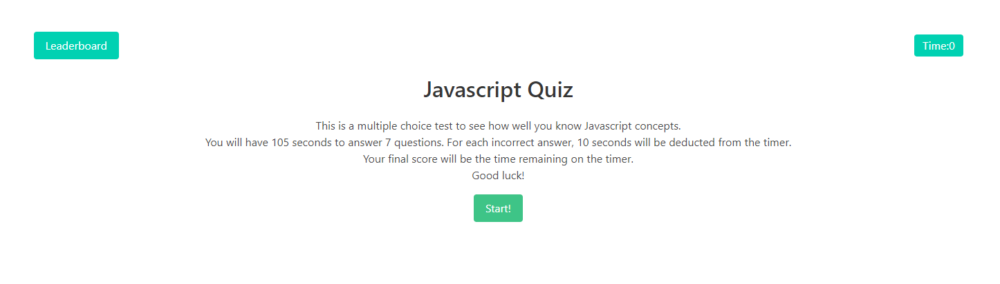

# Coding Quizzer

The Coding Quizzer is an interactive game that runs in the browser. The user is presented with a series of coding-related questions and must answer them within a given time limit. The time remaining at the end of the quiz is the user's score.



## Table of Contents

- [General Info](#general-info)
- [Technologies](#technologies)
- [Installation](#installation)
- [Usage](#usage)
- [Deployed Application](#deployed-application)
- [License](#license)

## General Info

The game features a countdown timer, and for each question the user answers incorrectly, time is subtracted from the timer. The quiz ends when the time runs out or when the user has answered all questions. At the end of the quiz, the user can save their initials and score to a leaderboard.

## Features

**Dynamic Question Rotation:**  
   Each quiz session features shuffled questions to provide a unique experience every time.

**Time Penalty for Wrong Answers:**  
   Adds an element of challenge; users lose time for every incorrect answer.

**Scoreboard Feature:**  
   Users can see their scores, providing a competitive element to the quiz. 

**Responsive Design:**  
   The quiz is mobile-friendly and works across various device sizes.

## Technologies

Project is created with:
* HTML5
* CSS
* JavaScript
* Bulma

## Installation

To run this project, clone the repository and open the `index.html` file in a web browser.

```bash
$ git clone https://github.com/dustinii/quizzer.git
```

## Usage 

1. Open the Coding Quiz Challenge in your web browser.
2. Click on the "Start" button.
3. Answer the prompts within the given time limit.
4. If the answer is incorrect, time is deducted from the timer.
5. The quiz ends when the time runs out or when all questions are answered.
6. Enter your initials to save your score to the high score list.

## Deployed Application
[Javascript Quizzer](https://dustinii.github.io/quizzer/)

## License

This project is open source and available under the [MIT License](LICENSE).
